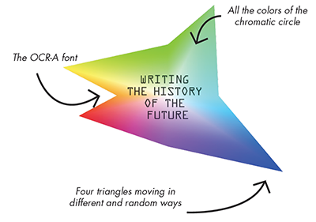

# ZKM - Writing the History of the Future - Logo Redesign 

![IMAC badge](https://img.shields.io/badge/IMAC-%202022-brightgreen.svg?link=https://www.ingenieur-imac.fr/&logo=data%3Aimage%2Fpng%3Bbase64%2CiVBORw0KGgoAAAANSUhEUgAAABIAAAAOCAYAAAAi2ky3AAAACXBIWXMAAAsTAAALEwEAmpwYAAAF0WlUWHRYTUw6Y29tLmFkb2JlLnhtcAAAAAAAPD94cGFja2V0IGJlZ2luPSLvu78iIGlkPSJXNU0wTXBDZWhpSHpyZVN6TlRjemtjOWQiPz4gPHg6eG1wbWV0YSB4bWxuczp4PSJhZG9iZTpuczptZXRhLyIgeDp4bXB0az0iQWRvYmUgWE1QIENvcmUgNS42LWMxNDUgNzkuMTYzNDk5LCAyMDE4LzA4LzEzLTE2OjQwOjIyICAgICAgICAiPiA8cmRmOlJERiB4bWxuczpyZGY9Imh0dHA6Ly93d3cudzMub3JnLzE5OTkvMDIvMjItcmRmLXN5bnRheC1ucyMiPiA8cmRmOkRlc2NyaXB0aW9uIHJkZjphYm91dD0iIiB4bWxuczp4bXA9Imh0dHA6Ly9ucy5hZG9iZS5jb20veGFwLzEuMC8iIHhtbG5zOmRjPSJodHRwOi8vcHVybC5vcmcvZGMvZWxlbWVudHMvMS4xLyIgeG1sbnM6cGhvdG9zaG9wPSJodHRwOi8vbnMuYWRvYmUuY29tL3Bob3Rvc2hvcC8xLjAvIiB4bWxuczp4bXBNTT0iaHR0cDovL25zLmFkb2JlLmNvbS94YXAvMS4wL21tLyIgeG1sbnM6c3RFdnQ9Imh0dHA6Ly9ucy5hZG9iZS5jb20veGFwLzEuMC9zVHlwZS9SZXNvdXJjZUV2ZW50IyIgeG1wOkNyZWF0b3JUb29sPSJBZG9iZSBQaG90b3Nob3AgQ0MgMjAxOSAoV2luZG93cykiIHhtcDpDcmVhdGVEYXRlPSIyMDIwLTA4LTExVDIyOjMyOjA5KzAyOjAwIiB4bXA6TW9kaWZ5RGF0ZT0iMjAyMC0wOC0xMVQyMzowMTowMiswMjowMCIgeG1wOk1ldGFkYXRhRGF0ZT0iMjAyMC0wOC0xMVQyMzowMTowMiswMjowMCIgZGM6Zm9ybWF0PSJpbWFnZS9wbmciIHBob3Rvc2hvcDpDb2xvck1vZGU9IjMiIHhtcE1NOkluc3RhbmNlSUQ9InhtcC5paWQ6MWY0YmVlZDYtMTVkNi0yZTQ4LWEzNzEtMTQyYjNmNTAzNTljIiB4bXBNTTpEb2N1bWVudElEPSJhZG9iZTpkb2NpZDpwaG90b3Nob3A6OWMzMTI5OGMtNWU5Mi1jZjQ1LTk5YmYtNGZhYmU0MjQyMTk4IiB4bXBNTTpPcmlnaW5hbERvY3VtZW50SUQ9InhtcC5kaWQ6ZTEwNGUyOTktNjI2OS04OTQ1LTk3ZjEtMGM0NDkzYzQ0M2EyIj4gPHhtcE1NOkhpc3Rvcnk%2BIDxyZGY6U2VxPiA8cmRmOmxpIHN0RXZ0OmFjdGlvbj0iY3JlYXRlZCIgc3RFdnQ6aW5zdGFuY2VJRD0ieG1wLmlpZDplMTA0ZTI5OS02MjY5LTg5NDUtOTdmMS0wYzQ0OTNjNDQzYTIiIHN0RXZ0OndoZW49IjIwMjAtMDgtMTFUMjI6MzI6MDkrMDI6MDAiIHN0RXZ0OnNvZnR3YXJlQWdlbnQ9IkFkb2JlIFBob3Rvc2hvcCBDQyAyMDE5IChXaW5kb3dzKSIvPiA8cmRmOmxpIHN0RXZ0OmFjdGlvbj0ic2F2ZWQiIHN0RXZ0Omluc3RhbmNlSUQ9InhtcC5paWQ6MWY0YmVlZDYtMTVkNi0yZTQ4LWEzNzEtMTQyYjNmNTAzNTljIiBzdEV2dDp3aGVuPSIyMDIwLTA4LTExVDIzOjAxOjAyKzAyOjAwIiBzdEV2dDpzb2Z0d2FyZUFnZW50PSJBZG9iZSBQaG90b3Nob3AgQ0MgMjAxOSAoV2luZG93cykiIHN0RXZ0OmNoYW5nZWQ9Ii8iLz4gPC9yZGY6U2VxPiA8L3htcE1NOkhpc3Rvcnk%2BIDwvcmRmOkRlc2NyaXB0aW9uPiA8L3JkZjpSREY%2BIDwveDp4bXBtZXRhPiA8P3hwYWNrZXQgZW5kPSJyIj8%2BoyRRbQAAA4xJREFUKJFdk1tsFFUAhv9zZnb21u3eurVQoK3bIi3WKqbWglViQhvTjYqkicQokOhDiUqiRAMiiSYkXoJUE2OBxgfSBxS5RYy1aTZSIQi2UoLEym5rwXR72e3eZ3d2Zs45Pogh4Xv5376n7yftzx0GAOQ1fdnqKu%2BxQMP6g92FQ0Mh9UivwZZ3Llptm3ta2pDyVn231t806jBvfEGLYTSVB1Hv9KMAHYQAMv5DIuBDIOShvOyplrnRBFnsE4x4BXAEACPgWzixbREg8wT8W9wDndECuMUCLGKtGrnueRDdicHG9smhg7l8wKssTcOeuBku6JlRQ%2FLCzmfgNie%2BMYTtJVNwEHJXJO%2BtOQueI8hGLW9Xl4b9mwMj2%2BTELDL5Soxv%2F%2BD9omfF8Qo9hnTmetbviJ8zeR6M2AbLZMXKhfj6fxERBzzAlAScw8vMah5L%2BJxwNij4dXc%2Fxtq68o48QpZZ4%2FzFmfcg2IlOhy34U6vbh4YyD2Ka6DVA%2BxWJQ3q9fRWKDsfOVNo1kMq5URVfmB5s7D38leuFlmzfWRdNp7a3tNeNr%2FE9dVPVJ6eSxcz5%2BdL6V0YSTpLjllCzV01TSi5TkcOnUPCl0sohu3lcDtg7b8X5nitHR581JRm1HUEsZua%2BT6rszZXuPjCx4efwQqE%2BlidzQVsGnIu%2BbJEckvUL1MlUCqyUYe0RBrgozi45kJfq1Ei9ivk%2FckjHc2CC2esqp1Hn%2BQdd5da8Irj%2BwwUViwUJPpdwUabSnSTP3nUpGdhj6eW4vBR2c%2F0d%2BKqHo5EY%2Fpy4jdsp%2F4uERD%2BuuW8PJPr3o5JePkMsSo1vWTmKJexfSPFXpc8qgXItfdH%2B%2B2LSOp59Bm5asaErsumSucIWlZ8Wmik%2Fv66Wnwqt%2BxEmG3tch%2BcXAWI3tTJUeMRetcAOaCUGKfDIDlxzP4CraLwyteb%2B2uCu9MPOihi6SlfhmEjubzNvHF3bRWHxOJ6IL0VHBbIWyV4CmG03TOcncwkNJYNDmu34CL%2F5WxBufHLfSX%2FoLZYR6LBGoJyk2BQZfmyjd%2FLaWGv76qS9YdgtKiTNmIGg6huUl31OTDcWkkVoOodcXVoEAAst8q1CEPRrW6OrLi0c3%2FbXmV3J5jpXQXH16NxiCpagTqUZBk%2B%2BltRODFAuAUTcLfvOGhy0m1J%2B2iNnP9Q062k4eZaAhwDsuNNukPFCmIAMgEj3Xg3%2FAiD3pieRCazTAAAAAElFTkSuQmCC) 

## Concept

***Writing the History of the Future*** is an art exhibition from the ZKM | Center for Art and Media in Karlsruhe. 

The idea with this project is to come up with an alternative logo for this exhibition. While creating a new visual identity from scratch, it is important that the new logo still embodies the ideas and represent this unique cultural institution that is the ZKM. Considering that the ZKM is the "MECCA OF MEDIA ARTS" we took inspirations from a very broad range of past and present concepts from the media culture.

## Authors 

- **Fanny JOSEPH** - *master's degree student from IMAC*
- **Erwann LEFEVRE** - *master's degree student from IMAC*
- **Nils LANDRODIE** - *master's degree student from IMAC*

## Project 1 : Rewriting with colors

### Inspirations

The general concept of this logo is based on colors. We wanted to used every single color possible. As a result, the chromatic circle of Johanes Itten is our major inspiration.

For writing the title in the logo, we decided to use the font OCR-A (Optical Character Recognition). This font was made by Adrian Futiger and the National Institute of norms and the technology in 1966.
It was created to be recognized by electronics devices (it is respecting some amount of specifics norms) in order to ease the treatment of documents. Each character is create on a 4x7 grid.

The artist Jean-Paul Fourmentraux said interresting things about computer programming in the artistic creation.
In fact, it is changing several things such as interactivity and autonomy. Interactivity is the fact of being manipulated because of the presence of an audience in the exhibition. Autonomy is the fact that artificial creatures can create art alone. Moreover, algorithms give art a generative form.
That is why we thought that it was necessary to study and take into account the concepts of interactivty and autonomy of Fourmentraux.

### Explanations 

We created a generative and random shape made with four branches/triangles. The concept of randomness is important when we use the generative performance of an algorithm. That is why, we made the shape evolve all the time within a perpetual movement.
Not only it as a generative logo, but it is also interactive for the spectator who has an impact on the shape. By moving the mouse on the shape, the end of the branch attaches itself to the mouse and the spectator can control this part of the shape. By doing that, the spectator is blocking the flow of randomness generate where is mouve is standing. The idea was inspired by Bruno Christophe because we wanted to stop the structural fluidity, to have an impact on what computers are genereting and show it to the spectator.
By this control is only partial, because only one branch is trapped and controled by the mouse. The other three are still generated randomly. In this way, we wanted to say that our logo shows the real impact that we have on technologies today. Indeed, we can have an impact on something at a specific time and depending on what our actions are, but in reality, it is only one part which is control, the rest still works regardless of our actions. That is why our logo summarizes the action of man on computers and its structural fluidity.



### Posters with our logo

|                                               |                                               |
| --------------------------------------------- | --------------------------------------------- |
|  |  |

 

## Project 2 : Rewriting with typography


## Getting started

If you want to visualize the projects and play with the interactivity :

* Download and install Processing [here](https://processing.org/download/)
* Open the ```.pde``` with processing and press play
* Use your mouse to interact with the design

*Note for **Rewriting with colors***  :

⚠️🔊 SOUND WARNING 🔊 ⚠️ Depending on the devices the sound might be loud.

*Note for **Rewriting with typography***  :

If you have a Tobii EyeTracker you can use the eyetracker version of the project.
For that you will need to have the GazeTrack library and the TobiiStream application.
You can find the files and installation informations [here](http://web.tecnico.ulisboa.pt/augusto.esteves/GazeTrack/).

